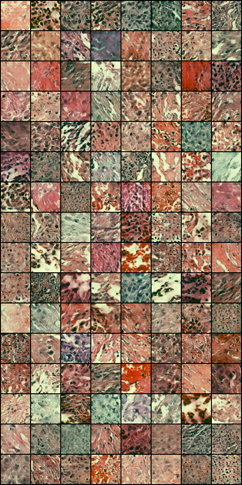
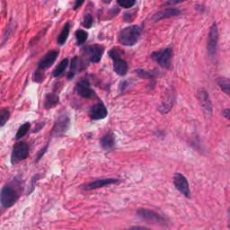

# GeneGAN

GeneGAN at its current stage takes in wsi (Whole Slide Images) in `.svs` format, 
samples the wsi for quality tissue samples and uses a simple DCGAN to 
generate wsi images.

## Setup

1. We need openslide to execute the patch generation part of the code.

   `brew install openslide`
    or Install OpenSlide (see https://openslide.org/download/)

2. Install the dependencies in your local dev environment 

    `source activate <local_dev_env>`  
    `pip install -r requirements.txt`

## Steps to run code

1. `python preprocess.py [-h] -s raw_slides_folder -p patches_output_folder 
[-t parsed_slides_folder] [-m masks_folder_if_exists]`
2. `python dcgan.py` 

## Results

The result of the trained DCGAN after about 42 epochs were as below

The Samples generated from the wsi slides look like
 

The different in the color of the training and generated images is because the during training, the images were normalized
per channel from the overall distribution of the training images 